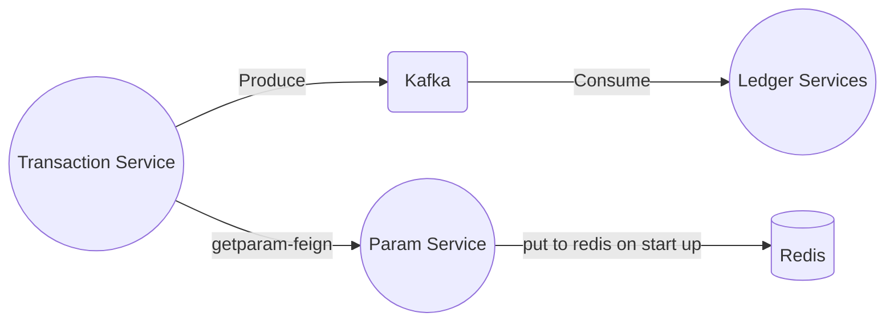

# Sample Microservices Apps with Springboot
Aplikasi microservices tentang pencatatan transaksi pembelian menggunakan Spring Boot.

## Flow Aplikasi

- Setiap service memiliki DB masing-masing. 
- `transaction-service` berkaitan dengan proses transaksi (simpan trx, data terkait item trx). service ini akan menyimpan data saat user melakukan hit enpoin `/submit` kemudian produce data ke kafka dengan topic `TRANSACTION_JOURNAL` 
- `param-service` berkaitan dengan data parameter. service ini akan meload seluruh data `table parameter` dan disimpan ke redis saat startup aplikasi.
- `ledger-service` berfungsi untuk melakukan pencatatan transaki pembelian.

## *Services*
Aplikasi terdiri dari 3 services: 
- `Transaction Service` --> Berkaitan dengan proses transaksi (submit data transaksi)
- `Param Service` --> Data parameter (get parameter)
- `Ledger Service` --> Pencatatan transaksi (consumer kafka)
- `Kafka & Zookeeper`
Semua berjalan di lokal 

## *Dependency*
Adapun beberapa *dependency* yang digunkan:

 - Feign Client
 - Redis (param-service)
 - Security (basic auth)
 - postgressql jdbc
 - Kafka (Transaction & Ledger) 
 - Lombok 
 - JPA

### Thankssss 🌺 
